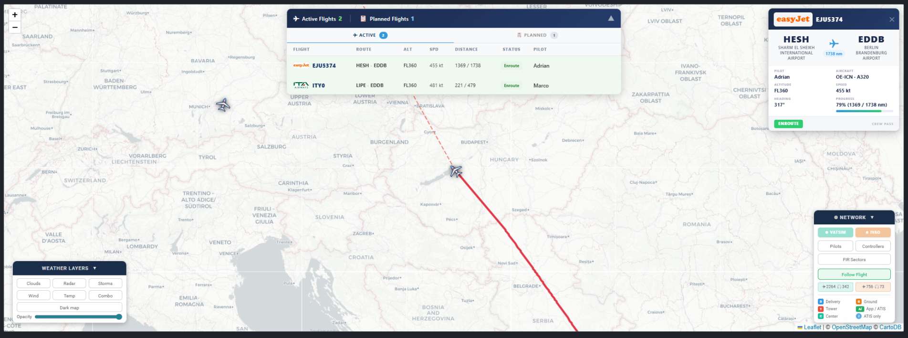

# VATSIM Live Map for phpVMS 7

A fully featured live map override for [phpVMS 7](https://github.com/phpvms/phpvms) that adds real-time VATSIM integration, weather overlays, and a modern popup design.

> **Weather overlay concept** based on [Weather Overlay on the Live Map](https://github.com/ncd200/Weather-Overlay-on-the-Live_Map) by **Rick Winkelman (Air Berlin Virtual)**

---

## 🌍 Live Demo

**[Live Karte - German Sky Group](https://german-sky-group.eu/livemap)**



---

## 📦 Installation

This repo contains a **single file**: `live_map.blade.php`

Copy it to the correct path depending on your theme:

| Theme | Path |
|-------|------|
| **seven** (default) | `resources/views/layouts/seven/widgets/live_map.blade.php` |
| **beta** | `resources/views/layouts/beta/widgets/live_map.blade.php` |
| **default** | `resources/views/layouts/default/widgets/live_map.blade.php` |
| **SPTheme** | `resources/views/layouts/SPTheme/widgets/live_map.blade.php` |
| **Disposable_v3** | `resources/views/layouts/Disposable_v3/widgets/live_map.blade.php` |

> Not sure which theme you use? Check your phpVMS Admin → Settings → General → Theme.

---

## 🔑 OpenWeatherMap API Key (required for weather overlays)

1. Register for free at [openweathermap.org](https://home.openweathermap.org/users/sign_up)
2. Open `live_map.blade.php` and find:
```javascript
var OWM_API_KEY = "YOUR_OPENWEATHERMAP_API_KEY_HERE";
```
3. Replace with your key.

> ⚠️ Without a valid key the weather buttons are hidden automatically — the map works fully without weather.

---

## ✨ Features

### VATSIM Integration
- Live pilots with aircraft icons rotated by heading
- Controllers with color-coded badges (DEL / GND / TWR / APP / CTR)
- FIR/UIR sector boundaries from VATSpy data
- TRACON / Approach Control automatically merged into the nearest airport marker
- ATIS collapsed by default, expandable — no more giant popups
- Full airport name in controller popups
- Refreshes every 30 seconds

### Badge Legend (built into VATSIM panel)
| Badge | Color | Meaning |
|-------|-------|---------|
| **D** | 🔵 Blue | Delivery |
| **G** | 🟠 Orange | Ground |
| **T** | 🔴 Red | Tower |
| **Ai** | 🟢 Green | Approach + ATIS |
| **C** | 🩵 Teal | Center / FIR |
| **i** | 💙 Light Blue | ATIS only |

### Own VA Flights
- Large distinctive aircraft icon — always visible above VATSIM traffic
- Click any aircraft → dashed route line to destination airport
- Follow Flight toggle — auto-pan or scroll freely

### Weather Overlays
- Clouds, Radar, Storms, Wind, Temperature, Combo layers
- Opacity slider + Dark map toggle

### Popup Design
- Card-style popups for pilots, controllers and FIR sectors
- Airline logos loaded from your own phpVMS database (always current)
- Badge legend built into the VATSIM panel

### Airline Logos in VATSIM Popups

When a VATSIM pilot's callsign matches an airline in your phpVMS database, their logo is automatically shown in the popup.

**How it works:**
The map reads the first 3 letters of the VATSIM callsign (the ICAO airline code, e.g. `DLH` from `DLH187`) and looks for a matching airline in your phpVMS database. If found **and** that airline has a logo uploaded, it is displayed in the popup.

**Requirements:**
1. The airline must be created in your phpVMS Admin → **Airlines**
2. The airline's **ICAO code** must match the VATSIM callsign prefix (e.g. `DLH` for Lufthansa)
3. A **logo must be uploaded** for that airline in phpVMS

**Example:**
- VATSIM flight `DLH187` → ICAO prefix `DLH` → phpVMS finds airline "Lufthansa" with ICAO `DLH` → logo shown ✅
- VATSIM flight `RYR123` → ICAO prefix `RYR` → airline not in your phpVMS database → no logo shown, popup works normally ✅

> This means logos only appear for airlines you have configured in your VA. This is intentional — your phpVMS database always has up-to-date, correct logos since you manage them yourself. External logo CDNs often have outdated or incorrect logos (e.g. old Lufthansa yellow crane instead of the current blue one).

---

## 🎛️ VATSIM Control Panel — Button Guide

The VATSIM panel is displayed in the bottom-right corner of the map. Here is what each button does:

---

### ✈️ Pilots
**Toggles the display of all VATSIM pilots on the map.**

- When active: every pilot currently connected to VATSIM and airborne is shown as a small blue aircraft icon, rotated according to their heading
- Clicking a pilot marker opens a popup showing: callsign, route (departure › arrival), aircraft type, altitude, speed, heading and pilot name
- If the airline exists in your phpVMS database with a logo, the logo is shown at the top of the popup
- Clicking a pilot also draws a **dashed red line** from the aircraft to its destination airport

> Turning this off is recommended when you only want to monitor controllers — with 800+ pilots worldwide the map can get very busy.

---

### 🎧 Controllers
**Toggles the display of all active VATSIM ATC stations on the map.**

- Each airport with active controllers gets a marker showing color-coded badges (see badge legend below)
- Clicking an airport marker opens a popup with all active controllers at that airport, their frequencies, ratings, and how long they have been online
- ATIS information is shown collapsed — click **"Show full ATIS"** to expand the full text
- TRACON / Approach Control stations that are not tied to a specific airport are automatically placed at the nearest airport within 80km

> This layer is active by default on page load.

---

### 🗺️ FIR Sectors
**Toggles the display of FIR (Flight Information Region) and UIR sector boundaries.**

- Draws the airspace boundaries for active Center / FIR controllers as colored, semi-transparent polygons on the map
- Each polygon is clickable and shows the controller info for that sector
- Multiple sub-sectors (e.g. EDMM-GER, EDMM-HOF) are shown as separate polygons but share one popup
- The sector label (callsign + frequency) is shown at the center of the largest sub-sector

> Very useful for seeing at a glance which regions have active radar coverage.

---

### 🎯 Follow Flight
**Controls whether the map automatically follows your own VA aircraft.**

- **Active (green):** the map continuously pans to keep your own aircraft centered as it moves
- **Inactive (grey — "Free Scroll"):** the map stays where you left it, you can scroll and zoom freely without the camera jumping back
- You can still zoom in and out freely regardless of whether Follow Flight is on or off
- Only affects your own VA aircraft (the white icon with red stripe), not VATSIM traffic

> Useful when you want to monitor your own flight without losing your view of the surrounding traffic.

---

### 📍 Route Line (click on any aircraft)
**Not a button — activated by clicking on any aircraft marker.**

- Click any VATSIM pilot or your own VA aircraft → a dashed red line is drawn from the aircraft to its filed destination airport
- The destination ICAO code is shown as a small label at the airport
- Click anywhere on the map to remove the line

---

### 🌦️ Weather Layers (bottom-left panel)

| Button | Shows |
|--------|-------|
| **Clouds** | Cloud coverage overlay |
| **Radar** | Precipitation radar |
| **Storms** | Thunderstorm cells |
| **Wind** | Wind speed & direction |
| **Temp** | Temperature overlay |
| **Combo** | Clouds + precipitation combined |
| **Dark map** | Switches the base map to a dark/night style |
| **Opacity slider** | Adjusts transparency of the active weather layer |

> Requires a free OpenWeatherMap API key — see setup instructions above.

---

Find these variables near the top of the `<script>` block:

```javascript
// VATSIM refresh interval in ms (VATSIM policy minimum = 15000)
var VATSIM_REFRESH_MS = 30000;

// Default layer visibility on page load
var vatsimShowPilots  = false;   // Pilots
var vatsimShowCtrl    = true;    // Controllers
var vatsimShowSectors = false;   // FIR Sectors
```

---

## 🗺️ Data Sources

| Source | Purpose |
|--------|---------|
| [VATSIM Data API v3](https://data.vatsim.net/v3/vatsim-data.json) | Live pilots & controllers |
| [VATSpy Data Project](https://github.com/vatsimnetwork/vatspy-data-project) | Airport positions & FIR boundaries |
| [VATSIM Transceivers](https://data.vatsim.net/v3/transceivers-data.json) | Fallback controller positions |
| [OpenWeatherMap](https://openweathermap.org/api/weathermaps) | Weather overlays |
| phpVMS database | Airline logos |

---

## 📋 Requirements

- phpVMS 7 (any recent version)
- HTTPS (required for VATSIM API and weather tiles)
- Optional: Free [OpenWeatherMap API key](https://home.openweathermap.org/users/sign_up)

---

## 🙏 Credits

- **Weather overlay concept:** [Rick Winkelman (Air Berlin Virtual)](https://github.com/ncd200/Weather-Overlay-on-the-Live_Map)
- **VATSIM integration & design:** German Sky Group

---

## 📄 License

MIT — free to use, modify and share. Credit appreciated.
